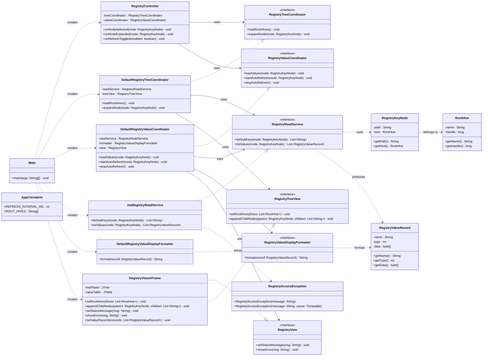

# Windows Registry Viewer — Java SOLID + MVC Implementation

Project: Windows Registry Viewer Refactoring  
Course: Advanced Programming Laboratory  
Date: March 2026  
Students: TOWHID AL MAHMUD & ABIR KHAN SIAM

## Table of Contents
- Part A — Project Overview
- Part B — Build & Usage
- Part C — Architecture & Design
- Part D — Refactoring Documentation
- Part E — Appendices

---

## PART A — PROJECT OVERVIEW

### 1. Introduction
This project is a Windows Registry Viewer desktop application built in Java (Swing).  
It was refactored from a procedural mindset into a modular Object-Oriented Design applying both **SOLID principles** and the **MVC (Model-View-Controller)** architectural pattern.

### What This Application Does
- Browse root hives (`HKEY_CLASSES_ROOT`, `HKEY_CURRENT_USER`, etc.)
- Expand registry keys lazily from tree navigation
- Display selected key values in a sortable table format
- Auto-refresh value panel at a configurable interval
- Keep read-only behavior for safe inspection

### 2. Project Version (Current)
This repository contains one SOLID + MVC focused Java implementation.

#### Characteristics
- Clean package-based structure aligned to MVC layers
- Interface-driven design (`RegistryReadService`, `RegistryValueDisplayFormatter`, view contracts)
- Controller + coordinator separation for SRP
- JNA integration for Windows registry read access
- JavaDoc-covered key classes and interfaces

### 3. Technology Stack
| Component | Technology | Purpose |
|---|---|---|
| Language | Java (JDK 11+) | Core implementation |
| UI | Swing | Desktop interface |
| Windows Integration | JNA + Advapi32 | Registry API access |
| Build | Makefile + javac | Compilation and run tasks |
| Platform | Windows | Target OS |

### 4. Repository Structure
```text
registryviewer_SOLID/
├── Main.java                               ← Composition root (wires MVC)
├── app/                                    ← CONTROLLER layer
│   ├── RegistryController.java
│   ├── RegistryTreeCoordinator.java
│   ├── DefaultRegistryTreeCoordinator.java
│   ├── RegistryValueCoordinator.java
│   └── DefaultRegistryValueCoordinator.java
├── config/
│   └── AppConstants.java
├── domain/                                 ← MODEL layer (data)
│   ├── RootHive.java
│   ├── RegistryKeyNode.java
│   └── RegistryValueRecord.java
├── registry/                               ← MODEL layer (data access)
│   ├── RegistryReadService.java
│   ├── JnaRegistryReadService.java
│   ├── RegistryValueDisplayFormatter.java
│   ├── DefaultRegistryValueDisplayFormatter.java
│   └── RegistryAccessException.java
└── ui/                                     ← VIEW layer
    ├── RegistryView.java
    ├── RegistryTreeView.java
    └── RegistryViewerFrame.java
```

---

## PART B — BUILD & USAGE

### 5. Build Requirements
- Windows 10/11
- JDK 11 or later
- JNA jars in `lib/`:
  - `jna-*.jar`
  - `jna-platform-*.jar`
- Optional: `make` command (or run `javac` manually)

### 6. Compilation Instructions
If `make` is available:
```sh
make build
```

If `make` is not available, compile manually from project root:
```powershell
New-Item -ItemType Directory -Force -Path build | Out-Null
$src = Get-ChildItem -Path registryviewer_SOLID -Recurse -Filter *.java | ForEach-Object { $_.FullName }
$jna = (Get-ChildItem lib\jna*.jar | Select-Object -First 1).FullName
$jnap = (Get-ChildItem lib\jna-platform*.jar | Select-Object -First 1).FullName
javac -encoding UTF-8 -d build -cp "build;$jna;$jnap" $src
```

### 7. Running the Application
Using `make`:
```sh
make run
```

Manual run:
```powershell
$jna = (Get-ChildItem lib\jna*.jar | Select-Object -First 1).FullName
$jnap = (Get-ChildItem lib\jna-platform*.jar | Select-Object -First 1).FullName
java -cp "build;$jna;$jnap" org.example.registryviewer.Main
```

### 8. Troubleshooting
- `make` not found: use manual `javac`/`java` commands above.
- JNA jar missing: place both JNA jars inside `lib/`.
- Non-Windows launch: app exits by design (Windows-only). `Main.java` checks `os.name` and calls `System.exit(1)` on non-Windows systems.

---

## PART C — ARCHITECTURE & DESIGN

### 9. MVC Architecture

This project implements the **Model-View-Controller (MVC)** pattern across its package structure. Each layer has a clearly defined responsibility and communicates through interfaces, not concrete types.

#### MVC Layer Mapping

| MVC Layer | Packages | Key Classes |
|---|---|---|
| **Model** | `domain/`, `registry/` | `RegistryKeyNode`, `RegistryValueRecord`, `RootHive`, `RegistryReadService`, `JnaRegistryReadService`, `RegistryValueDisplayFormatter` |
| **View** | `ui/` | `RegistryView` (interface), `RegistryTreeView` (interface), `RegistryViewerFrame` (Swing impl) |
| **Controller** | `app/` | `RegistryController`, `DefaultRegistryTreeCoordinator`, `DefaultRegistryValueCoordinator` |

#### Model
The Model is split into two sub-packages:

- **`domain/`** — pure, immutable data objects. `RegistryKeyNode` represents a tree node, `RegistryValueRecord` is an immutable row for the value table, and `RootHive` is an enum of the five standard registry roots. None of these classes know anything about Swing or registry access.
- **`registry/`** — data-access and formatting logic. `RegistryReadService` is a read-only interface for Windows registry operations. `JnaRegistryReadService` implements it using JNA/Advapi32. `RegistryValueDisplayFormatter` converts raw `Map<String, Object>` values into typed display records. `RegistryAccessException` wraps Win32 errors so callers do not depend on JNA exception types.

#### View
The View layer uses **interface-driven contracts** so the controller never depends on Swing directly:

- `RegistryView` — base interface exposing `setStatus()`, `getKeyTree()`, and `getValueTableModel()`.
- `RegistryTreeView` — extends `RegistryView` with tree model access and the auto-refresh toggle control.
- `RegistryViewerFrame` — the concrete Swing `JFrame` implementing both interfaces. It contains only layout code — no registry calls, no business logic.

#### Controller
The Controller layer handles all user-driven events and delegates to coordinators:

- `RegistryController` — implements `TreeSelectionListener` and `TreeExpansionListener`. Receives UI events, calls the appropriate coordinator, and updates the view's status. It never touches raw registry handles or Swing internals directly.
- `RegistryTreeCoordinator` / `DefaultRegistryTreeCoordinator` — responsible for populating root hives and lazy-loading child nodes on tree expansion.
- `RegistryValueCoordinator` / `DefaultRegistryValueCoordinator` — responsible for reading values for the selected key, formatting them, and pushing rows into the view's table model.

#### Wiring (Composition Root)
`Main.java` acts as the composition root. It creates one instance of each concrete class and wires them together:

```java
RegistryViewerFrame frame = new RegistryViewerFrame();
RegistryController controller = new RegistryController(
    frame,
    new JnaRegistryReadService(),
    new DefaultRegistryValueDisplayFormatter()
);
controller.initialize();
```

No class other than `Main` holds references to concrete implementations — all internal references are to interfaces.

#### MVC Data Flow

```
User action (click / expand)
        │
        ▼
  RegistryController          ← Controller receives Swing events
        │
   ┌────┴────┐
   ▼         ▼
TreeCoord  ValueCoord         ← Coordinators call the Model
        │
        ▼
  RegistryReadService          ← Model reads Windows registry
        │
        ▼
  RegistryValueRecord          ← Model produces data objects
        │
        ▼
  RegistryViewerFrame          ← View renders result
```

### 10. Layered View
```text
Main (composition root)
   └─> app (controller + coordinators)
         ├─> ui (view contracts + Swing frame)
         ├─> registry (read service + format strategy)
         └─> domain (immutable value models)
```

### 11. UML Class Diagram



### 12. SOLID Principles Analysis
- **SRP:** `RegistryController` handles UI events; tree loading and value loading are delegated to dedicated coordinators.
- **OCP:** New data sources or formatters can be added by implementing interfaces without changing controller flow.
- **LSP:** Any `RegistryReadService` or `RegistryValueDisplayFormatter` implementation can replace the defaults transparently.
- **ISP:** Small interfaces (`RegistryView`, `RegistryTreeView`, `RegistryTreeCoordinator`, `RegistryValueCoordinator`) keep contracts focused.
- **DIP:** High-level app logic depends on interfaces; `Main` wires concrete implementations at startup.

### 13. Package Responsibility Mapping
- `domain`: pure immutable data models (Model)
- `registry`: Windows registry data access + value formatting policies (Model)
- `ui`: Swing view and view contracts (View)
- `app`: orchestration and application logic (Controller)
- `config`: static configuration/constants

---

## PART D — REFACTORING DOCUMENTATION

### 14. Prompts Used (Step-by-Step)

#### Step 1 — Initial Conversion Prompt
```text
Convert the existing procedural C project into Java using object-oriented design.
Use classes, objects, encapsulation, inheritance, and polymorphism where appropriate.
```

#### Step 2 — SOLID Refactoring Prompt
```text
Refactor the Java code by applying SOLID principles:
SRP: one responsibility per class,
OCP: open for extension, closed for modification,
LSP: implementations should be substitutable,
ISP: prefer small focused interfaces,
DIP: depend on abstractions, not concrete classes.
```

#### Step 3 — MVC Architecture Prompt
```text
Organize the project into MVC layers:
Model: domain data objects and registry read service,
View: Swing frame implementing view interfaces,
Controller: RegistryController and coordinator classes handling user events.
Main.java should be the only composition root that wires concrete implementations.
```

#### Step 4 — Package Organization Prompt
```text
Organize the project into maintainable packages such as model/domain, service/repository,
application/controller, and interface/ui layers.
```

#### Step 5 — Documentation Prompt
```text
Add proper JavaDoc comments across major classes and interfaces.
Create a README.md describing project structure, MVC pattern, SOLID application, and run instructions.
```

### 15. Key Refactoring Changes
- Applied MVC pattern: separated Model (`domain/`, `registry/`), View (`ui/`), and Controller (`app/`) into distinct packages.
- Introduced coordinator abstractions for tree and value workflows to preserve SRP in the controller.
- Kept UI rendering fully separate from registry I/O concerns.
- Preserved extension points with interfaces for service and formatter (OCP + DIP).
- `Main.java` acts as the sole composition root — all other classes depend only on interfaces.
- Improved JavaDoc in key contracts and implementations.

### 16. Lessons Learned
- MVC + SOLID reinforce each other: MVC defines *where* responsibilities live, SOLID defines *how* each piece is designed internally.
- Interface-first design made refactoring safer and the controller testable in isolation.
- Splitting responsibilities reduced controller complexity.
- Windows-specific logic is best isolated in registry service implementations, making the rest of the code platform-neutral.

---

## PART E — APPENDICES

### 17. Dependency Flow Verification
- UI depends on view contracts and app controller only.
- Controller depends on abstractions, not JNA implementation details.
- Registry implementation depends on JNA/Windows API wrappers.
- No circular dependencies across packages.
- `Main.java` is the only class that imports both concrete and interface types — by design.

### 18. Contact
- **Student 1:** TOWHID AL MAHMUD
- **Student 2:** ABIR KHAN SIAM
- **Course:** 0714 02 CSE 2100 — Advanced Programming Laboratory

---
